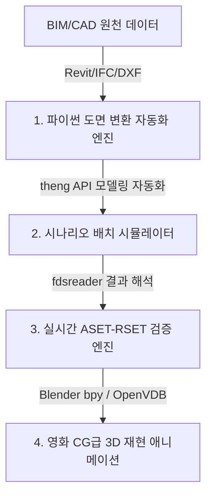

# 🏥 BIM/CAD 도면 기반 화재·대피 3D 재현 시뮬레이션 및 애니메이션 개발 로드맵

> **개요**: BIM/CAD 도면을 파싱하여 실제 요양병원 화재 시나리오를 FDS/Pathfinder 수준으로 시뮬레이션하고, 이를 시각적으로 극대화된 **고화질 3D 재현 애니메이션**으로 제작하는 기술적 원리와 개발 로드맵입니다.

---

## 📌 1. 우리가 이 환경(파이썬 API)으로 개발할 수 있는 것들

방금 구축하신 파이썬 환경(`theng`, `fdsreader`, `pywin32`, `plotly` 등)을 확장하면 다음과 같은 혁신적인 솔루션들을 자체 개발할 수 있습니다.



### 1-1. 개발 가능한 솔루션 4단계
1. **도면 변환 자동화 엔진 (BIM/CAD → Simulation)**
   - Revit(`.rvt`), IFC(`.ifc`), AutoCAD(`.dxf`)의 공간 벽체 데이터를 파이썬(`ifcopenshell`, `ezdxf` 라이브러리)으로 읽어, PyroSim(`.psm`) 및 Pathfinder(`.pth`) 입력 파일로 자동으로 변환 및 3D 공간 격자를 구성해 주는 파이프라인.
2. **시나리오 배치 시뮬레이터 (Batch Simulator)**
   - 화재 발생 지점(1층 로비, 3층 병실, 엘리베이터 홀 등)과 환자 유형 비율(와상 환자 80%, 휠체어 20% 등)을 파이썬 매개변수로 입력하면, **수십 개의 시뮬레이션을 백그라운드에서 자동으로 생성하고 FDS/Pathfinder를 구동시키는 완전 자동화 배치 툴**.
3. **실시간 피난 여유 시간(Safety Margin) 판독 모듈**
   - 방금 구동 완료한 스크립트처럼, 시뮬레이션 완료 즉시 구역별 ASET-RSET을 계산하여 **위험 병목 구간을 소방 비전문가도 즉시 인지할 수 있는 인터랙티브 대시보드로 자동 웹 발행**.
4. **초고화질 재난 재현 3D 애니메이션 (CGI Reconstruction)**
   - 단순한 소방 프로그램의 거친 그래픽을 탈피하여, 실제 병원 도면 위에 실제 불길과 연기, 환자들의 움직임을 영화 수준의 고화질 3D 애니메이션으로 구현하는 비주얼 콘텐츠 제작 프레임워크.

---

## 🎬 2. 실제 BIM/CAD 도면 기반 "재현 애니메이션" 제작 원리와 단계

질문하신 **"BIM, CAD 도면을 읽어서 실제 FDS처럼 시뮬레이션하고 재현 애니메이션을 만드는 것"**은 완벽하게 가능합니다. 이를 구현하는 데는 실무 레벨부터 초고화질 CG 레벨까지 3가지 경로가 있습니다.

### 2-1. [경로 A] 시뮬레이터 내장 엔진 활용 (실무 최단 경로)
PyroSim과 Pathfinder의 자체 3D Results Viewer 기능을 활용하는 방식입니다.

* **원리**:
  1. **BIM/CAD 가져오기**: Revit `.rvt` 또는 표준 `.ifc` 파일을 Pathfinder/PyroSim으로 직접 드래그합니다.
     - **Pathfinder의 강점**: IFC 도면의 문(Door)과 방(Room) 속성을 해석하여 **피난 가능 3D 네비게이션 메쉬를 단 3초 만에 자동으로 추출**합니다.
  2. **시뮬레이션 수행**: FDS로 화재 연기 거동을 풀고, Pathfinder로 캐릭터 피난을 돌립니다.
  3. **결과 결합 및 내보내기**: 두 프로그램의 Results Viewer를 연동하여 3D 화면 상에 **"연기 하강(Volumetric Smoke Rendering) + 환자/의료진 캐릭터들의 피난 거동"**을 동시에 띄웁니다.
  4. **카메라 패스 세팅**: 뷰어 내에서 카메라 이동 경로를 지정하고 고화질 비디오(MP4, AVI)로 **재현 애니메이션 동영상을 렌더링 및 내보내기**합니다.

---

### 2-2. [경로 B] 파이썬 기반 인터랙티브 3D 뷰어 개발 (경량 웹/앱 솔루션)
자체 소프트웨어나 웹 브라우저 상에서 동작하는 3D 시뮬레이터를 개발하는 방식입니다.

* **원리**:
  - **도면 파싱**: 파이썬의 `ezdxf`(CAD) 및 `ifcopenshell`(BIM)을 사용하여 평면 선 데이터 및 3D 솔리드를 추출합니다.
  - **결과 파싱**: `fdsreader`를 통해 FDS의 Slice 가시거리 및 온도를 프레임 단위의 3D 넘파이(NumPy) 배열로 변환하고, Pathfinder의 시간별 에이전트 3D 좌표($x, y, z$) 데이터를 파싱합니다.
  - **웹 3D 재현**: **Three.js(자바스크립트)** 또는 파이썬의 **PyVista / Open3D** 라이브러리를 사용하여 웹 브라우저 상에 3D 건물을 띄우고, 에이전트들을 점이나 간이 캐릭터로 움직이며, 연기 농도를 3D 복셀(Voxel) 입자 애니메이션으로 실시간 드로잉하는 **웹 기반 3D 재현 플레이어**를 개발할 수 있습니다.

---

### 2-3. [경로 C] Blender 3D + FDS 파이썬 API 결합 (헐리우드 CG급 재현 애니메이션)
최근 글로벌 소방 방재 학계 및 고급 컨설팅에서 가장 주목받는 **초고화질 재난 시뮬레이션 시각화** 방식입니다.

```
[BIM/CAD 도면] ────> Blender 3D (정밀 매핑 & 조명 세팅)
                                     │
[FDS 결과 (Smoke)] ─(Python)─> OpenVDB 볼륨 변환 ─> [영화급 3D 재현]
                                     │            (Cycles 엔진 렌더링)
[Pathfinder 에이전트] ─(Python)─> 캐릭터 모션 바인딩 ─┘
```

* **핵심 메커니즘**:
  1. **오픈소스 3D 엔진 Blender 활용**: Blender는 파이썬 API(`bpy` 모듈)를 완벽하게 지원하는 헐리우드급 3D 제작 엔진입니다.
  2. **고급 연기 변환 (OpenVDB)**: FDS가 출력한 3D 연기 농도 바이너리 파일을 파이썬 스크립트를 사용하여 **영화 산업 표준 3D 볼륨 포맷인 `OpenVDB`** 파일 시퀀스로 변환합니다 (Github에 오픈소스 FDS-to-VDB 변환 툴 다수 존재).
  3. **캐릭터 모션 바인딩**: Pathfinder가 저장한 에이전트 좌표 csv를 파이썬 코드로 읽어, Blender 내의 실제 환자 및 소방관 3D 캐릭터들의 움직임 프레임 애니메이션으로 자동 매핑합니다.
  4. **시네마틱 렌더링**: Blender의 레이트레이싱 엔진(Cycles)을 돌리면 연기 속의 빛 산란, 실제 이글거리는 불길, 실감 나는 그림자 등이 완벽히 렌더링되어 **"실제 뉴스나 재난 영화에서 볼 수 있는 극사실적 화재 재현 애니메이션"**이 탄생합니다.

---

## 🏆 3. 제안서에 어떻게 녹여내서 가점을 받을 것인가?

이 기술적 비전을 이번 행정안전부 제안서에 녹여내면 **"단순 학술 용역 수준을 초월한 독보적인 실감형 연구 기술 보유"**로 평가받게 됩니다.

> [!TIP]
> **제안서 삽입용 차별화 멘트 예시**:
> *"본 연구진은 단순 수치 계산용 시뮬레이션에 그치지 않고, 수집된 BIM/CAD 도면과 FDS/Pathfinder 시뮬레이션 데이터를 자체 개발한 **파이썬 데이터 파이프라인(theng-fdsreader)**과 연계합니다. 이를 통해 실제 화재 시 요양병원 층별 연기 강하 상태와 환자 피난 흐름을 소방 비전문가(의료진, 요양보호사, 지자체 공무원)도 즉각 직관적으로 인지하고 훈련할 수 있는 **'실감형 3D 재현 애니메이션 및 인터랙티브 웹 시뮬레이터 개발 기술'**을 제안하며, 이는 향후 요양시설 소방 계획 및 대피 매뉴얼 표준화의 시각적 완성도와 대국민 홍보 효과를 극대화할 것입니다."*

---

## 🛠️ 4. 다음 단계 개발을 위한 파이썬 기반 추천 라이브러리

BIM과 CAD 도면을 직접 파이썬으로 다루며 재현 플레이어를 개발할 때 도입할 수 있는 필수 패키지 목록입니다. (필요 시 즉시 세팅해 드립니다.)

* **CAD/DXF 도면 파싱**: `ezdxf` (DXF 파일의 벽체 레이어를 분석하여 평면 추출)
* **BIM/IFC 데이터 제어**: `ifcopenshell` (BIM 객체의 공간 구조와 벽체 두께 등 메타데이터 추출)
* **경량 3D 가시화**: `pyvista` 또는 `trimesh` (파이썬 상에서 3D 도면 메시와 에이전트 좌표를 동적으로 회전하며 재생할 수 있는 3D 캔버스 구현)
