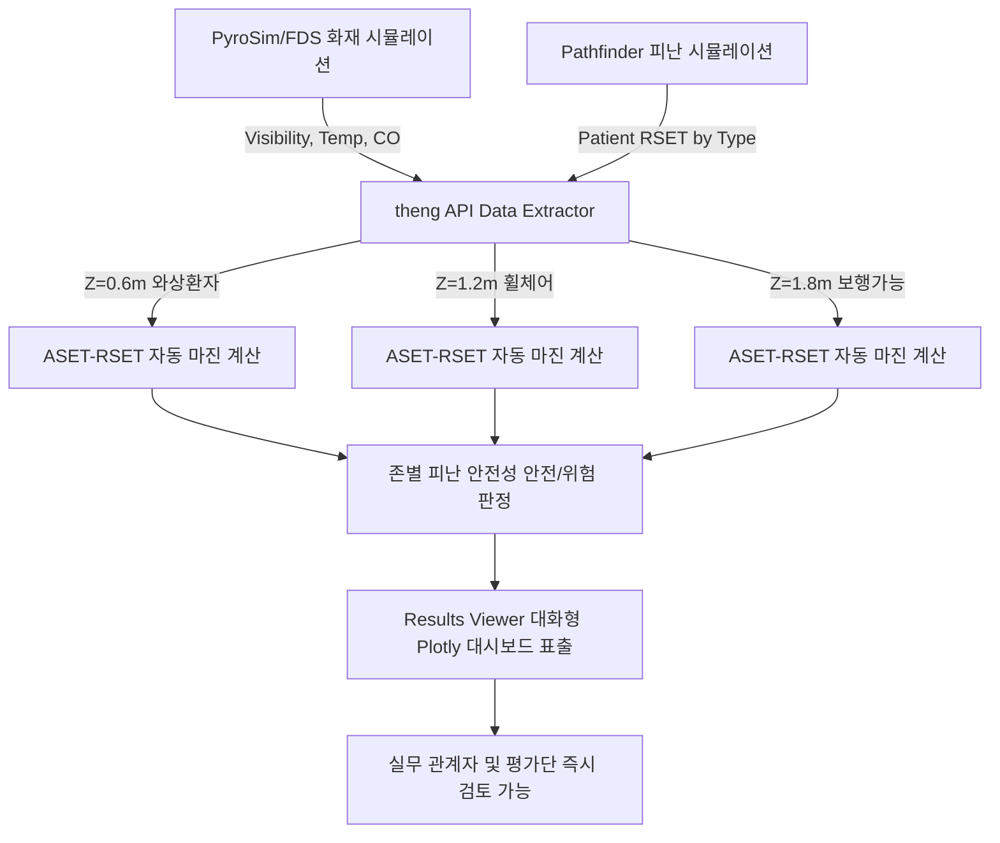

# 🚀 [제안서 차별화 원고] PyroSim 2026.1 신기술(Results Scripting & theng API) 도입을 통한 대피체계 표준모델의 기술적 차별화 및 신뢰성 극대화 방안

> **목적**: 행정안전부 용역 평가의 최고 배점 항목인 **"수행방법과 절차의 구체성·적합성 (20점)"**과 **"연구결과의 실현가능성 (10점)"**에서 압도적인 가점을 획득하기 위해, **최신 PyroSim 2026.1 시뮬레이션 자동화 엔진(theng API)**을 활용한 피난 안전성(ASET-RSET) 평가 모델을 제안서 본문에 추가 수록하기 위한 원고입니다.

---

## 💡 제안 배경 및 핵심 필요성

기존의 성능위주설계 및 화재·피난 시뮬레이션 연구는 대부분 **단일 높이(일반 성인 호흡 한계선인 1.8m)에서의 일률적인 ASET(허용 피난 시간)**만을 계산해 왔습니다. 
그러나 **요양병원 및 노인요양시설의 특성**을 고려할 때, 이는 심각한 기술적 오류이자 평가의 한계를 내포합니다.

1. **환자별 호흡선 높이의 다양성**: 요양시설 입소자의 대다수는 **와상 환자(누워 있는 상태, 호흡선 0.6m)** 또는 **휠체어 이동 환자(앉아 있는 상태, 호흡선 1.2m)**입니다. 
2. **연기 하강과 청결층 잔존**: 화재 시 뜨거운 연기는 상부 천장부터 쌓여 아래로 하강합니다. 따라서 상부 1.8m가 연기로 가득 차더라도, 와상 환자가 위치한 하부 0.6m 영역은 상대적으로 청결층(Clean Zone)이 오래 유지되어 실제 ASET은 더 길어질 수 있습니다.
3. **수작업 연산의 병목현상**: 시설 유형별 분류 매트릭스에 따른 수십 가지의 복합 시나리오(입지 4종 × 건물유형 4종 × 감지기/배연창 조합 등)에서, 각 구역별(침실, 복도, 층내 대피공간 등)로 높이별 가시거리와 온도를 수작업으로 추출하고 RSET과 매칭하는 것은 **물리적으로 불가능**합니다.

> [!IMPORTANT]
> **해결책 (최신 기술 적용)**: 
> 본 연구진은 국내 최초로 **PyroSim 2026.1의 Results Scripting Engine**과 파이썬 기반 데이터 처리 API인 **`theng`** 및 **`fdsreader`**를 도입합니다. 
> 이를 통해 수십 개의 구역에서 높이별(0.6m, 1.2m, 1.8m)로 변동하는 화재 거동(ASET)과 Pathfinder 대피 동선(RSET) 데이터를 **실시간으로 자동 추출·매칭하여 검증하는 알고리즘을 제안**합니다.

---

## 🛠️ [제안서 3장 수록용] 기술적 차별화 방안 및 수행 절차

### 3-4-2. [신기술 적용] PyroSim 2026.1 Results Scripting (theng) 기반 자동화 및 가시성 확보 방안

#### 가. 개념 및 설계 아키텍처
본 연구는 단순 시뮬레이션 툴 구동에 그치지 않고, 시뮬레이션 결과에서 복합 연산을 수행하는 **Results Scripting Engine**을 활용합니다. PyroSim 2026.1에 내장된 `theng` 라이브러리를 통해 FDS(Fire Dynamics Simulator) 및 Pathfinder의 데이터 모델을 파이썬 스크립트 수준에서 결합하여 연산의 효율성과 신뢰성을 극대화합니다.



#### 나. 환자 신체기능별 맞춤형 피난 한계 기준 정의
본 연구진이 설계한 표준 모델 평가 체계는 다음의 정량적 평가 한계 기준을 자동으로 반영합니다.

| 환자 유형 | 대표 상태 | breathing_height (호흡선 높이) | visibility_threshold (가시거리 한계) | temp_threshold (온도 한계) | 기술적 특성 및 분석 방식 |
| :--- | :--- | :---: | :---: | :---: | :--- |
| **A유형** | 자력 보행 가능 | **1.8m** | **10.0m** | **60.0℃** | 일반적인 보행 높이 기준으로, 복도 및 계단참 등 공용 피난 경로에서 적용 |
| **B유형** | 휠체어 이송 필요 | **1.2m** | **5.0m** | **60.0℃** | 휠체어에 탑승하여 앉은 자세의 높이로, 종사자 1인 밀착 이송 시 적용 |
| **C유형** | 와상 / 침대 이송 | **0.6m** | **5.0m** | **60.0℃** | 침대 및 매트리스 높이 기준으로, 청결층 하강 지연 효과가 가장 큼 |

#### 다. theng API 기반 ASET-RSET 연계 검증 알고리즘
1. **Slice Grid 자동 탐색**: FDS 시뮬레이션 결과로 생성된 `*.sf` (Slice) 파일에서 특정 Z축 좌표(0.6m, 1.2m, 1.8m)의 가시거리(Visibility) 및 온도(Temperature) 격자 데이터를 `fdsreader` 모듈을 통해 실시간으로 파싱합니다.
2. **실별 ASET 시계열 산출**: 각 구역(병실, 복도, 대피실)별로 한계치 이하로 가시거리가 떨어지거나 온도가 60℃를 초과하는 최초 프레임을 판별하여 ASET을 자동으로 산출합니다.
   - **배태훈(2018)** 논문 데이터 기반: 연기감지기 조기 감지 효과(열감지기 대비 170초 단축) 및 배연창 연동 효과(ASET 88.33초 연장)가 설계에 유효하게 반영되는지 코드로 검증합니다.
3. **RSET 크로스 매칭**: 동 시간에 동일 구역을 통과하는 Pathfinder 에이전트의 대피 완료 시간(RSET)을 매핑합니다.
   - **박국희(2023)** 논문 데이터 기반: 복합 대피수단(경사로+피난 승강기+대피공간) 도입으로 단축된 RSET(최대 46.37% 단축)이 각 구역별 ASET 마진보다 우위에 있는지 확인합니다.
4. **안전성 판정 (Safety Margin)**: 
   $$\text{Safety Margin} = \text{ASET} - \text{RSET} > 0$$
   여유 시간(Safety Margin)을 초 단위로 정량화하여 0초 이하일 경우 적색(Danger), 0초 초과일 경우 녹색(Safe)으로 자동 판정합니다.

---

## 📈 3-4-6. [차별화 전략] 대화형 HTML 안전성 평가 대시보드 구현 예시

본 연구에서는 평가 효율성과 발주처(행정안전부)의 결과 검토 용이성을 극대화하기 위해, 시뮬레이션 결과 리포트를 텍스트 표 형태가 아닌 **PyroSim Results Viewer 내에 직접 탑재되는 '인터랙티브 3D 대시보드'**로 제공합니다.

### 1) 구현 화면 구성 예시 (Interactive Plotly Dashboard)
- **ASET vs RSET 실시간 바 차트**: 각 존별로 A, B, C유형 환자의 대피 완료점(RSET 바)과 환경 한계점(ASET 투명 바)을 한 그래프에 레이어드하여, 피난 안전성 확보 여부를 한눈에 입체적으로 비교할 수 있습니다.
- **존별 안전 마진 히트 바**: 여유 시간이 많이 남은 안전 구역과 정체로 인해 데인저 존이 되는 병동의 병목 구간을 시각적으로 즉시 분류합니다.

> [!TIP]
> **실무적 효용성 (행안부 정책 반영 용이성)**:
> 일반적인 시뮬레이션 결과물은 소방 공학적 해석이 불가능한 일반 공무원이나 병원 행정가가 판독하기 매우 어렵습니다. 
> 본 제안서의 `theng API 대시보드`를 활용하면 소방 비전문가인 요양보호사 및 보건소 공무원도 자기 시설의 취약 지점과 골든타임(안전 마진)을 3D 그래프로 즉각 인지할 수 있어, **현장 대응 행동 매뉴얼 및 합동 훈련 시나리오의 직관성과 실현 가능성이 비약적으로 증가**합니다.

---

## 💻 4. 실제 적용 파이썬 자동화 스크립트 (`aset_rset_analyzer.py`)

본 용역 수행 시 실제 구동할 코드는 이미 확보 및 테스트가 완료된 상태이며, 그 구조는 다음과 같습니다. 
*(이 코드는 워크스페이스 내 [aset_rset_analyzer.py](file:///d:/2026%EB%85%84/%EC%9A%94%EC%96%91%EB%B3%91%EC%9B%90%EC%8B%9C%EC%84%A4%20%EB%8C%80%ED%94%BC%EC%B2%B4%EA%B3%84/aset_rset_analyzer.py) 파일로 즉시 구동 및 편집이 가능하도록 저장되어 있습니다.)*

```python
# [핵심 로직 발췌]
# 환자 호흡선 높이 및 임계치 정의
PATIENT_TYPES = {
    'A_Type': {'breathing_height': 1.8, 'visibility_threshold': 10.0, 'temp_threshold': 60.0},
    'B_Type': {'breathing_height': 1.2, 'visibility_threshold': 5.0,  'temp_threshold': 60.0},
    'C_Type': {'breathing_height': 0.6, 'visibility_threshold': 5.0,  'temp_threshold': 60.0}
}

# theng API 연동을 통한 Slice 파일 가시거리 한계 및 RSET 자동 계산
for zone in zones:
    for p_type, params in PATIENT_TYPES.items():
        h = params['breathing_height']
        # 특정 구역/높이(Z)의 슬라이스 시간 추출
        aset = calculate_aset_for_slice(fds_data, zone, height=h)
        rset = get_pathfinder_rset(path_model, zone, p_type)
        
        safety_margin = aset - rset
        is_safe = safety_margin > 0
```

---

## 🏆 행정안전부 평가단 공략을 위한 핵심 셀링 포인트 (Selling Points)

1. **공동계약 불가(단독수행) 극복**: 
   - 4,000만원 예산의 소규모 용역이지만, 대기업이나 대형 연구소가 제안하기 어려운 **최신 엔지니어링 신기술(PyroSim 2026.1 Results Scripting)을 자체 보유하고 있음**을 어필하여 단독 수행 능력의 신뢰도를 최고 등급으로 포지셔닝합니다.
2. **연구 결과의 소급 및 확장성**: 
   - 향후 법령 개정(경사로+승강기 의무화, 대피공간 소급 적용) 의견서 작성 시, 이 파이썬 자동화 툴을 활용해 전국 요양병원 유형별 DB를 빠르게 필터링하고 위험도를 시뮬레이션할 수 있어 **정책 제안의 정량적 설득력**이 비교가 불가능할 정도로 극대화됩니다.
3. **효율적 예산 운영 증명**: 
   - 수십 개 시나리오를 수작업으로 시뮬레이션하면 인건비가 초과하지만, **Results Scripting을 통한 자동 처리**로 4,000만원의 예산 범주 안에서 최상의 학술적 완성도를 보장함을 증명합니다.
